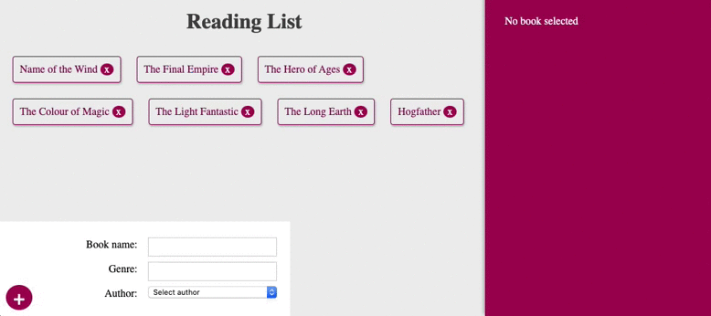

# GraphQl Reading list



## Server

Pour lancer le server

```bash
cd server
npx nodemon app.js
```

http://localhost:4000/graphql

### Exemple de queries avec graphiQL

```graphql
{
  book(id: "1") {
    name
    genre
    id
  }
}
```

```
{
  author(id: 1) {
    name
    age
    id
  }
}
```

```
{
  book(id: "5ea9e47b35194ab5f222233a") {
    name
    genre
    author {
      name
    }
  }
}
```

```
/* tous les book avec le nom et l'age de l'auteur
{
  books {
    name
    author{
      name
      age
    }
  }
}
```

### Mutation

```
mutation{
  addAuthor(name: "Terry Pratchett", age: 66){
    name
    age
  }
}


mutation{
  addBook(name: "Name of the Wind", genre: "Fantasy", authorId:"5ea9e304cdfa53b5c5841df3" ){
    name
    genre
  }
}
```

GraphQL tutorial from The Net Ninja

https://www.youtube.com/playlist?list=PL4cUxeGkcC9iK6Qhn-QLcXCXPQUov1U7f
